<h1 align="center">Microservice Restaurant</h1>

  A scalable microservices-based platform for seamless food ordering and restaurant management.

  
  
  
  
  
  
  

## Overview
A modern application built with **microservices architecture** to streamline restaurant operations, featuring user authentication, menu management, order processing, payment integration, inventory tracking, and real-time notifications. Designed for scalability and robust error handling.

## Tech Stack
- **Backend**: 
  - **Spring Boot (Java)**: Core service development with Spring Data JPA and Hibernate for ORM.
  - **.NET**: Select services for enhanced performance and integration.
- **Frontend**: **Next.js** with **Tailwind CSS** for a responsive, modern UI.
- **Databases**:
  - **PostgreSQL** (Neon, cloud-based) for production.
  - **MSSQL** for specific services.
  - **H2 Database** for development and testing.
- **API Gateway & Service Registry**: **Eureka** for service discovery and load balancing.
- **Message Broker**: **RabbitMQ** hosted on **CloudAMQP** for event-driven communication.
- **Authentication**: **JWT** for secure user authentication.
- **API Documentation**: **Swagger** for clear API contracts.
- **Deployment**: **Render** with **Docker** for containerized services, leveraging **CloudAMQP** for managed RabbitMQ.

- **Design Patterns**: 
  - **Saga Pattern**: Manages distributed transactions with compensation for order failures (e.g., out-of-stock or concurrent orders).
  - **Event-Driven Architecture (EDA)**: Utilizes RabbitMQ on CloudAMQP for asynchronous, decoupled service communication.

## Microservices
- **User Service**: Handles registration, login, and profile updates.
- **Menu Service**: Manages dishes and combos, linked with inventory.
- **Order Service**: Processes orders with Saga-based transaction management for stock conflicts.
- **Payment Service**: Integrates VNPay, supports discount codes, and tracks transactions.
- **Inventory Service**: Tracks ingredients with low-stock alerts.
- **Notification Service**: Sends real-time push notifications.

## Key Features
- **Robust Order Flow**: Saga pattern ensures reliable handling of out-of-stock dishes and concurrent orders with compensating transactions.
- **Scalable Deployment**: Dockerized services on Render, with cloud-based PostgreSQL (Neon) and MSSQL.
- **Real-Time Notifications**: RabbitMQ powers instant order updates.
- **Developer-Friendly APIs**: Swagger-documented for easy integration.

## Repository Structure
- **taste-flow-be**:
  - `/APIgateway`: API Gateway configuration.
  - `/EurekaServer`: Service registry for microservices.
  - `/InventoryService`: Manages ingredient stock.
  - `/MenuService`: Handles dish and combo management.
  - `/NotificationService`: Manages real-time notifications.
  - `/OrderService`: Old ( Legacy Version )
  - `/OrderService2`: Core order processing with Saga pattern.
  - `/PaymentService`: Payment integration and transaction tracking.
  - `/UserService`: User authentication and profile management.
- **taste-flow-fe**:
  - `/public`: Static assets for frontend.
  - `/src`: Source code for Next.js application.

## Setup Instructions
1. Clone: `git clone <repo-url>`.
2. Configure `application.properties` (Neon DB, MSSQL, H2, CloudAMQP credentials, JWT secrets).
3. Build and run: `docker-compose up --build`.
4. Access frontend at `http://localhost:3000` and APIs at `http://localhost:<port>/swagger-ui`.

## Order Flow Design
The order processing flow uses a **Saga pattern** to coordinate distributed transactions across services, ensuring reliable inventory checks and payment handling with compensation for failures.

**Order Processing Steps**:

```mermaid
---
config:
  theme: neo-dark
---
flowchart LR
    A[Client: POST /orders] --> B[Order: Pending]
    B --> C[Emit Order.Created] --> D[Inventory: Check stock]
    D -->|Enough| E[Lock Ingredients] --> F[Order: Confirmed]
    D -->|Out of stock| G[Emit Out_of_Stock] --> H[Order: Cancelled]
    F --> I[Emit Order.Confirmed] --> J[Payment: Record created]
    J --> K[Emit Payment.RecordCreated] --> L[Order: ReadyForPayment]
    L --> M[Frontend: Poll status] --> N[Frontend: POST /payments/:id/method]
    N --> O[Payment: Initiated] --> P[Emit Payment.Initiated]
    P --> Q[Client: Complete payment]
    Q -->|Success| R[Emit Payment.Success] --> S[Order: Complete] & T[Inventory: Deduct]
    Q -->|Fail/Timeout| U[Retry Payment]
    E -->|5 min no success| V[Inventory: Rollback] --> H & W[Payment: Cancelled]


```

## Why This Project?
Showcases expertise in **microservices**, **cloud-native deployment**, and **advanced patterns** (Saga, EDA) for complex workflows. Highlights proficiency in modern frameworks and scalable architecture.
